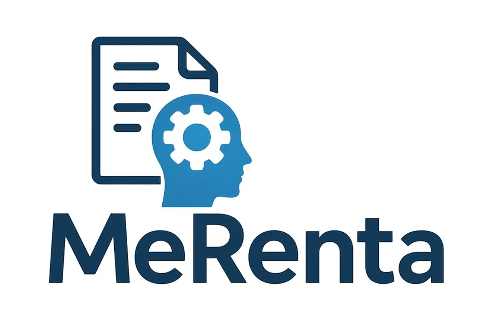

# MeRenta-Chatbot-Declaracion-de-la-Renta

This code introduces MeRenta, a chatbot designed to support taxpayers in filing their income tax returns through a Retrieval-Augmented Generation (RAG) approach. The system integrates document processing, a vector database of tax regulations, and a Language Model (LLM) capable of generating natural language answers grounded in official sources. The implementation was carried out in Python on Google Colab, leveraging libraries such as SentenceTransformers and FAISS for retrieval, and Gradio for the web interface. 

The evaluation employed standard NLP metrics (BLEU, METEOR, ROUGE-L, cosine similarity), comparing lightweight and medium-size models (Gemma, GPT-Neo, DistilGPT2, Llama, Qwen). 

Results indicate consistent performance, with the Qwen model standing out above the others, which showed very similar behavior to each other. The project confirms the feasibility of applying RAG techniques in the tax domain, simplifying the filing process and providing users with an accessible, transparent, and reliable tool. Limitations, ethical considerations, and future directions are discussed, including the integration of additional sources and pipeline optimization for production environments. 
